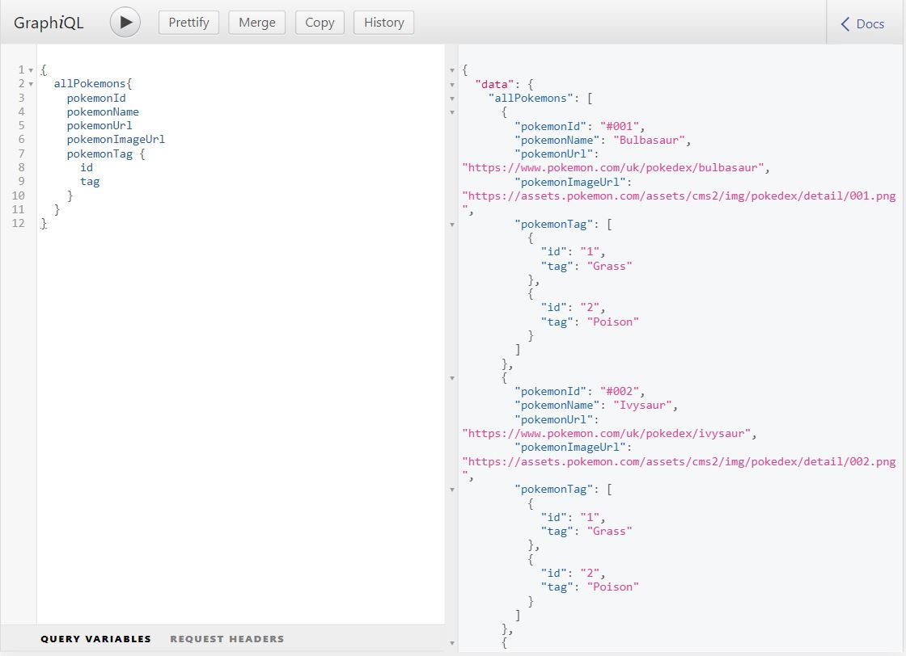

## **PokedexWithGraphene**
A project that is build on the top of the django and graphene(GraphQL - A query language for API) library. Used the django-extension to run script which loads data from json.

#### **Web Preview**  


###  graphql, django, ajax, webdevelopment, api

#### **Concepts Used** :-  
1. Many to many relationship between Django Models
2. Using django-extension to load data from json
3. Graphql to create a single source API endpoint to perform basic CRUD operation
4. Ajax calls to get data from Graphql endpoint

<h5>Preview Link -> <u><a href="https://raw.githubusercontent.com/chaudharypraveen98/PokedexWithGraphene/master/graphql3.JPG">PokedexWithGraphene</a></u></h5>

<h5>Source Code Link -> <u><a href="https://github.com/chaudharypraveen98/PokedexWithGraphene">GitHub</a></u></h5>


### What We are going to do?  

<ol>
    <li>Starting the Django Project</li>
    <li>Creating a music app within the PokedexWithGraphene Project</li>
    <li>Create a Album and Song model in pokemon/models.py</li>
    <li>Importing pokemon data from json file using  Django Extensions</li>
    <li>Writing GraphQL queries and schema</li>
    <li>Creating a view for handling the request made from the client</li>
    <li>Adding function handlers to routes</li>
    <li>Creating a Template for displaying the song data on the page</li>
    <li>Fetching data using ajax into templates</li>
</ol>

### Understanding Some Important Concepts  

#### What is Django Framework?
Django is a Python-based free and open-source web framework that follows the model–template–views architectural pattern.

**Top Features of Django Framework**
<ul>
    <li>Excellent Documentation</li>
    <li>SEO Optimised</li>
    <li>High Scalability</li>
    <li>Versatile in Nature</li>
    <li>Offers High Security</li>
    <li>Provides Rapid Development</li>
</ul>


## Step 1 => Starting the Django Project
Initialize a Django project by following command. **Python** must be installed on your system.

```
pip install Django
```


You can confirm the installation by checking the django version by following command

```
python -m django --version
```


**Starting the Project**  

```
django-admin startproject PokedexWithGraphene
```


You get the project structure like this

```
PokedexWithGraphene/
    manage.py
    PokedexWithGraphene/
        __init__.py
        settings.py
        urls.py
        asgi.py
        wsgi.py
```


## Step 2 -> Creating a pokemon app within the PokedexWithGraphene Project  

### What is a Django App?  

An app is a Web application that does something – e.g., a Weblog system, a database of public records or a small poll app. 

A project is a collection of configuration and apps for a particular website. A project can contain multiple apps. An app can be in multiple projects.

Creating the pokemon app

```
python manage.py startapp pokemon
```


That’ll create a directory pokemon, which is laid out like this:

```
pokemon/
    __init__.py
    admin.py
    apps.py
    migrations/
        __init__.py
    models.py
    tests.py
    views.py
```

### Including your app and libraries in project  

```
INSTALLED_APPS = [
    'django.contrib.admin',
    'django.contrib.auth',
    'django.contrib.contenttypes',
    'django.contrib.sessions',
    'django.contrib.messages',
    'django.contrib.staticfiles',

    # for loading data
    'django_extensions',

    # our main reusable components
    'pokemon.apps.PokemonConfig',

    # graphql library
    'graphene_django'
]
```


## Step 3 -> Create a Pokemon and PokemonTag model in pokemon/models.py  

### What is a Django Model?  

A model is the single, definitive source of truth about your data. It contains the essential fields and behaviors of the data you’re storing. Django follows the DRY Principle. 

The goal is to define your data model in one place and automatically derive things from it.

**Let's create a Django Model.**

A database contains a number of variable which are represented by fields in django model.Each field is represented by an instance of a Field class – e.g., CharField for character fields and DateTimeField for datetimes. This tells Django what type of data each field holds.

```
from django.db import models


class PokemonTag(models.Model):
    tag = models.CharField(max_length=20)

    def __str__(self):
        return self.tag


class Pokemon(models.Model):
    pokemon_name = models.CharField(max_length=30)
    pokemon_url = models.CharField(max_length=30)
    pokemon_id = models.CharField(max_length=30, primary_key=True)
    pokemon_image_url = models.CharField(max_length=30)
    pokemon_tag = models.ManyToManyField(PokemonTag, related_name='pokemon')

    def __str__(self):
        return f"{self.pokemon_id}  {self.pokemon_name}"
```

Here, We have used the many to many relationship between the Pokemon and PokemonTag as there can be many tags for pokemon and vice versa.


### Adding models to admin panel  

Django provides built-in admin panel to manage the data into model

```
from django.contrib import admin

# Register your models here.
from pokemon.models import Pokemon, PokemonTag

admin.site.register(Pokemon)
admin.site.register(PokemonTag)
```


## Step 4 -> Importing pokemon data from json file using  Django Extensions(pokemon/script/load_pokemons.py)  

### Django EXtension  

It will help us to load data seamlessly without much manual work. It uses the JSON library to do the task. 

```
import json
from pathlib import Path

from PokedexWithGraphene import settings
from pokemon.models import Pokemon, PokemonTag


def run(*args):
    file_path = Path(settings.BASE_DIR, 'pokemon/static/pokemon/pokemon.json')
    with open(file_path, encoding="utf8") as file:
        pokemon_data = json.loads(file.read())

    for pokemon in pokemon_data:
        pokemon_obj = Pokemon.objects.create(
            pokemon_url=pokemon["pokemon_url"],
            pokemon_name=pokemon["pokemon_name"],
            pokemon_id=pokemon["pokemon_id"],
            pokemon_image_url=pokemon["pokemon_image_url"]
        )
        pokemon_obj.pokemon_tag.add(*list(PokemonTag.objects.get_or_create(tag=pokemon)[0].id for pokemon in pokemon['pokemon_tags']))
        print(pokemon_obj.pokemon_id)
```


## Step 5 -> Writing GraphQL queries and schema.  

```
import graphene
from graphene_django.types import DjangoObjectType

from .models import Pokemon, PokemonTag


class PokemonType(DjangoObjectType):
    class Meta:
        model = Pokemon
        field = '__all__'


class PokemonTagType(DjangoObjectType):
    class Meta:
        model = PokemonTag


class Query(graphene.ObjectType):
    all_pokemons = graphene.List(PokemonType)
    pokemon_by_id = graphene.Field(PokemonType,id=graphene.String(required=True))

    def resolve_all_pokemons(self, info, **kwargs):
        return Pokemon.objects.all()

    def resolve_pokemon_by_id(self,info,id):
        try:
            return Pokemon.objects.get(pokemon_id=id)
        except Pokemon.DoesNotExist:
            return 404


schema = graphene.Schema(query=Query)
```

We are using the GraghQl playground to get the right query to get the data.




## Step 6 -> Creating a view for handling the request made from the client.  

### What is a Django View?  

A view function, or view for short, is a Python function that takes a Web request and returns a Web response. 

```
from django.shortcuts import render


# Create your views here.
def pokemon_home(request):
    return render(request, 'pokemon/pokemon_list.html')
```

We are using Django `render` in-built function.
The `render()`  function takes the request object as its first argument, a template name as its second argument and a dictionary as its optional third argument. It returns an `HttpResponse` object of the given template rendered with the given context.


## Step 7 -> Adding function handlers to routes.(PokedexWithGraphene/urls.py)  

Whenever user visit the user, a function is called in view which takes care of response.

```
"""PokedexWithGraphene URL Configuration"""
from django.conf.urls.static import static
from django.contrib import admin
from django.urls import path, include
from django.views.decorators.csrf import csrf_exempt
from graphene_django.views import GraphQLView

from PokedexWithGraphene import settings
from pokemon.schema import schema

urlpatterns = [
    path('admin/', admin.site.urls),
    path('graphql/', csrf_exempt(GraphQLView.as_view(
        graphiql=True, schema=schema
    ))),
    path('pokemons/', include('pokemon.urls'))
]
if settings.DEBUG:
    urlpatterns += static(settings.STATIC_URL,
                          document_root=settings.STATIC_ROOT)
    urlpatterns += static(settings.MEDIA_URL,
                          document_root=settings.MEDIA_ROOT)
```


**Adding sub path for pokemon app** 

It defines the particular path for pokemon app.

```
from django.urls import path

from pokemon import views

app = 'pokemom'

urlpatterns = [
    path('',views.pokemon_home),
                            ]
```


## Step 8 -> Creating a Template for displaying the song data on the page  

We are using the jinja templating engine for displaying the data. 

```
<!DOCTYPE html>
<html lang="en">
<head>
    <meta charset="UTF-8">
    <title>Pokemon List</title>
    
    <link rel="stylesheet" href="">
</head>
<body>
    <h1> class="head">Pokemon List</h1>
    <div> class="pokemon-container card-group">
    </div>
    <script> src="https://code.jquery.com/jquery-3.5.1.min.js" integrity="sha256-9/aliU8dGd2tb6OSsuzixeV4y/faTqgFtohetphbbj0=" crossorigin="anonymous"></script>
    <script> src=""></script>
</body>
</html>
```

`<script> src=""></script>` : - This script will fetch the data explained in next step


## Step 9 -> Fetching data using ajax into templates  

Fetching data using the ajax call to the pokemon route `127.0.0.1:8000/pokemons/`  

**pokemons/static/pokemon/pokemon-list.js**  

```
$(function () {

    'use strict';
    $.ajax({
        type: 'POST',
        url: '../graphql/',
        contentType: "application/json",
        data: JSON.stringify({
            query: "{  allPokemons{    pokemonId    pokemonUrl    pokemonName    pokemonImageUrl  pokemonTag{ tag }}}"
        }),
        success: function (data) {
            for (let i = 0; i < data['data']['allPokemons'].length; i++) {
                const pokemon = data['data']['allPokemons'][i];
                $(".pokemon-container").append(`
                    <div class="pokemon-card">
                        
                        <div class="pokemon-body">
                            <h5 class="pokemon-title">${pokemon['pokemonName']}</h5>
                            <h3 class="pokemon-id">${pokemon['pokemonId']}</h3>
                            <h4 class="pokemon-tags">${pokemon['pokemonTag'][0]['tag']}</h4>                        
                        <div class="pokemon-link">
                            <a href="${pokemon['pokemonUrl']}" class="pokemon-button">More Details</a>
                        <div>
                        </div>
                        </div>`
                );
            }
        },
        error: function (error_data) {
            console.log(error_data['responseText'])
        }
    })
});
```

### Add Some styles to make it attractive


## Deployment
You can easily deploy on <a href="https://www.heroku.com/">Heroku</a>

You can read more about on <a href="https://www.analyticsvidhya.com/blog/2020/10/step-by-step-guide-for-deploying-a-django-application-using-heroku-for-free/">Analytics Vidhya Blog</a>


## Web Preview / Output
<a href="https://raw.githubusercontent.com/chaudharypraveen98/PokedexWithGraphene/master/graphql3.JPG"></a>


##### **Note**
Feel free to suggest changes and make pull request.